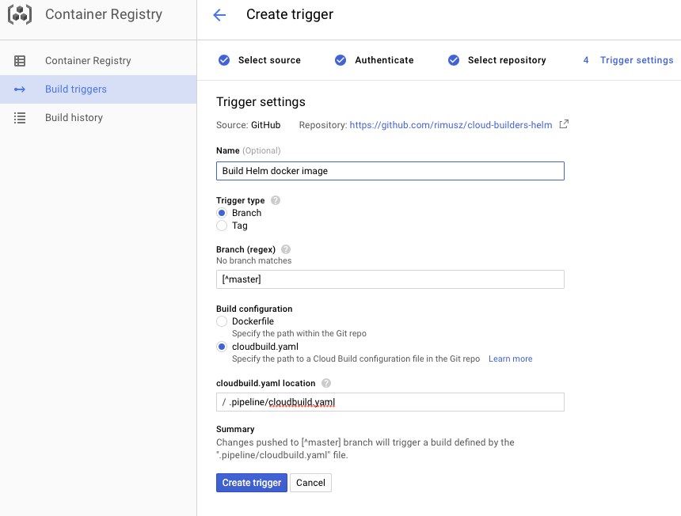

# GCP Container Builder with Helm client


This Container Builder build step runs [`helm`](https://github.com/kubernetes/helm).
Is available as `gcr.io/rimusz-lab1/cloud-builders-helm`

## Using this builder with Google Container Engine

To use this builder, your
[Cloud Build Service Account](https://cloud.google.com/cloud-build/docs/securing-builds/set-service-account-permissions)
will need IAM permissions sufficient for the operations you want to perform. For
typical read-only usage, the "Container Engine Viewer" role is sufficient. To
deploy container images on a GKE cluster, the "Container Engine Developer" role
is sufficient. Check the
[GKE IAM page](https://cloud.google.com/kubernetes-engine/docs/concepts/access-control)
for details.

For most use, `helm` will need to be configured to point to a specific GKE
cluster. That can be done using `kubectl` step (check [examples](examples))
where you need to configure the cluster by setting environment variables.

    CLOUDSDK_COMPUTE_ZONE=<your cluster's zone>
    CLOUDSDK_CONTAINER_CLUSTER=<your cluster's name>

Setting the environment variables above will cause this step's entrypoint to
first run a command to fetch cluster credentials as follows.

    gcloud container clusters get-credentials --zone "$CLOUDSDK_COMPUTE_ZONE" "$CLOUDSDK_CONTAINER_CLUSTER"`

The `kubeconfig` will be saved to `/workspace/.kube/config`, then, `helm` will
have the configuration needed to talk to your GKE cluster.

Example of `cloudbuild.yaml` file:

```
steps:

# fetch GKE cluster credentials to be used for helm step
- name: 'gcr.io/cloud-builders/kubectl'
  env:
  - 'CLOUDSDK_COMPUTE_ZONE=<your cluster zone>'
  - 'CLOUDSDK_CONTAINER_CLUSTER=<your cluster name>'
  - 'KUBECONFIG=/workspace/.kube/config'
  args: ['cluster-info']

# run helm command to install/upgrade etcd-operator
# optionally you can set to add any other Helm chart repository
# to use charts from
- name: 'gcr.io/$PROJECT_ID/cloud-builders-helm'
  args: ['upgrade', '--install', 'filebeat', '--namespace', 'filebeat', 'stable/filebeat']
  env:
  - 'KUBECONFIG=/workspace/.kube/config'
  - 'HELM_REPO_NAME=example'
  - 'HELM_REPO_URL=http://charts.example.com'
  - 'TILLERLESS=true'
  - 'TILLER_NAMESPACE=test'
```

## Using Helm

This builder supports two install options of Helm:
* The default one when the `tiller` gets installed into your GKE cluster.
* Secure `Tillerless Helm` where `tiller` runs outside the GKE cluster.

### Default Helm + Tiller setup

The default one when the `tiller` gets installed into your GKE cluster (oh all those `tiller` security issues).

You can test e.g. installing a chart via `Helm`, running the following command.

    gcloud builds submit . --config=examples/cloudbuild_not_tillerless.yaml


### Tillerless Helm setup

`Tillerless Helm` which solves all those `tiller` security issues, as `tiller` runs outside the GKE cluster.
I wrote a [blog post](https://rimusz.net/tillerless-helm/) how to use Helm local [tiller plugin](https://github.com/rimusz/helm-tiller).

You can test e.g. installing a chart via `Tillerless Helm`, running the following command.

    gcloud builds submit . --config=examples/cloudbuild.yaml

**Note:** Also if your GKE cluster has `RBAC` enabled, you must grant Cloud Build Service Account `cluster-admin` role (or make it more specific for your use case), but for some reason Cloud Build uses Cloud Build Service Account `uniqueId` to authenticate to the GKE cluster instead of it's email address.

Below is example how to set it up with `uniqueId`.

    # Get Cloud Build Service Account uniqueId
    user=$(gcloud iam service-accounts describe your_project_id@cloudbuild.gserviceaccount.com | grep -o 'uniqueId.*' | awk -v FS="('|')" '{print $2}')

    # Grant Cloud Build Service Account `cluster-admin` role
    kubectl create clusterrolebinding cluster-admin-$user --clusterrole cluster-admin --user $user

## Building this builder

To build this builder, run the following commands in this directory.

    $ ./.scripts/set_tag.sh
    $ gcloud container builds submit . --config=.pipeline/cloudbuild.yaml

The first step sets Helm client version (stored in TAG file) to be used for building the image,
and the second builds the docker image and stores it under your GCP `project/helm` repo.

You can also automate builds by using `Container Registry build trigger` and connecting it your your `Github` repo
as per example below:


